# Pattern Recognition – Complete Course Notes

This document summarizes the key concepts from a **Pattern Recognition** course (YouTube lectures).  
Each chapter includes a brief textual overview and the corresponding slide image.

---

## 📚 Table of Contents

1. [Introduction to Pattern Recognition](#chapter-1)
2. [Bayesian Decision Theory](#chapter-2)
3. [Maximum Likelihood & Bayesian Density Estimation](#chapter-3)
4. [Expectation-Maximization (EM) & Mixture Density](#chapter-4)
5. [Hidden Markov Models (HMM)](#chapter-5)
6. [Bayesian Belief Networks](#chapter-6)
7. [Non‑parametric Methods (Parzen Windows)](#chapter-7)
8. [Feature Reduction & Selection](#chapter-8)
9. [k‑Nearest Neighbor Classifier](#chapter-9)
10. [Linear Discriminants & Support Vector Machines](#chapter-10)
11. [Neural Networks & Decision Trees](#chapter-11)
12. [Unsupervised Learning & Clustering](#chapter-12)
13. [Algorithm‑Independent Learning Issues](#chapter-13)
14. [Structural & Syntactic Pattern Recognition](#chapter-14)

---

## Chapter 1 : Introduction to Pattern Recognition

**Overview:**  
Definition of pattern recognition and a real‑world example – **biometric recognition** (fingerprints, face, etc.).

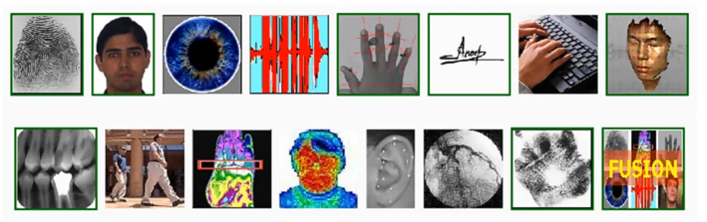

---

## Chapter 2 : Bayesian Decision Theory

**Overview:**  
Decision regions \( R_1 \) and \( R_2 \) with boundary \( x_B \) and optimal threshold \( x^* \).  
Uses posterior probabilities \( p(x|\omega_i)P(\omega_i) \). Introduces the concept of **reducible error**.

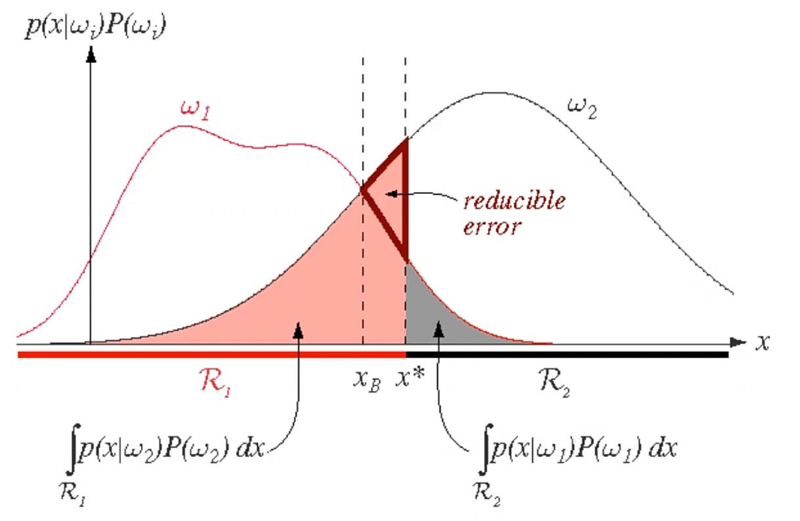

---

## Chapter 3 : Maximum Likelihood & Bayesian Density Estimation

**Overview:**  
Examples of true vs. estimated pdfs:  
- Gaussian \( N(10,4) \) estimated as \( N(10.1,3.9) \)  
- Mixture of two Gaussians estimated as a single Gaussian  
- Gamma(4,4) estimated by Gaussian and by Gamma(4.0,3.9)  
- Cumulative distribution functions comparison.

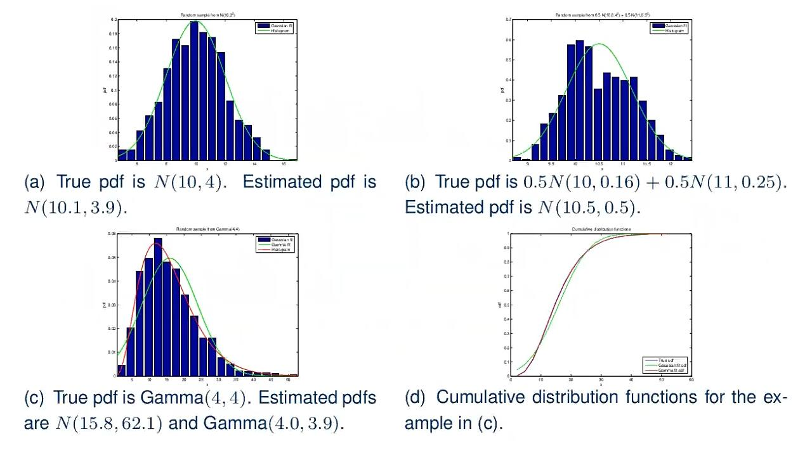

---

## Chapter 4 : Expectation-Maximization (EM) & Mixture Density

**Overview:**  
EM algorithm applied to a mixture of two Gaussians.  
Iterations shown for \( L = 2, 5, 20 \) (number of iterations or components) – illustrating convergence.

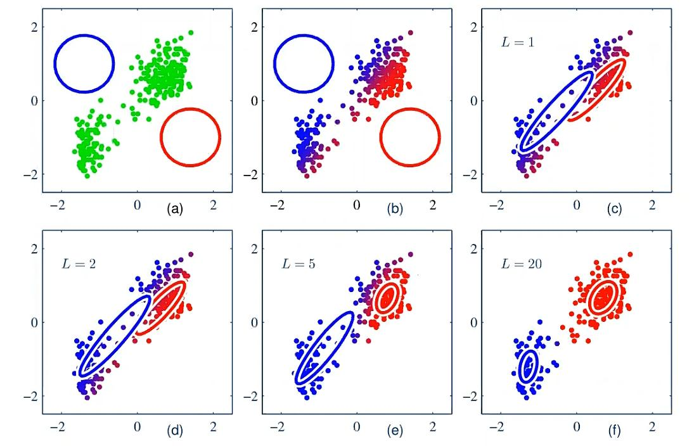

---

## Chapter 5 : Hidden Markov Models (HMM)

**Overview:**  
Three hidden states: \( w_1 \)=rain/snow, \( w_2 \)=cloudy, \( w_3 \)=sunny.  
Transition matrix:

\[
\Theta = \{a_{ij}\} = \begin{pmatrix}
0.4 & 0.3 & 0.3 \\
0.2 & 0.6 & 0.2 \\
0.1 & 0.1 & 0.8
\end{pmatrix}
\]

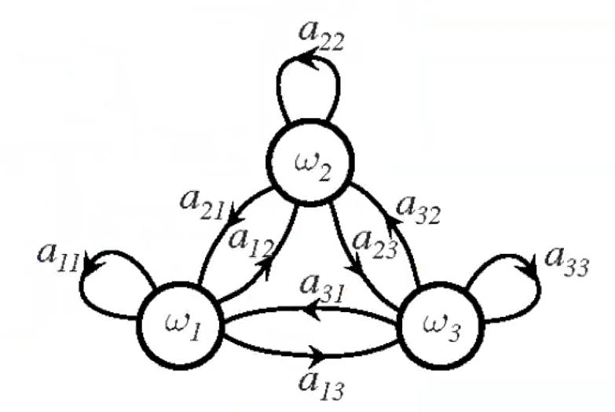

---

## Chapter 6 : Bayesian Belief Networks

**Overview:**  
Graph structure with nodes **A**, **B**, **X**, **C**, **D**.  
- Parents of X: A and B → \( P(x|a) \), \( P(x|b) \)  
- Children of X: C and D → \( P(c|x) \), \( P(d|x) \)

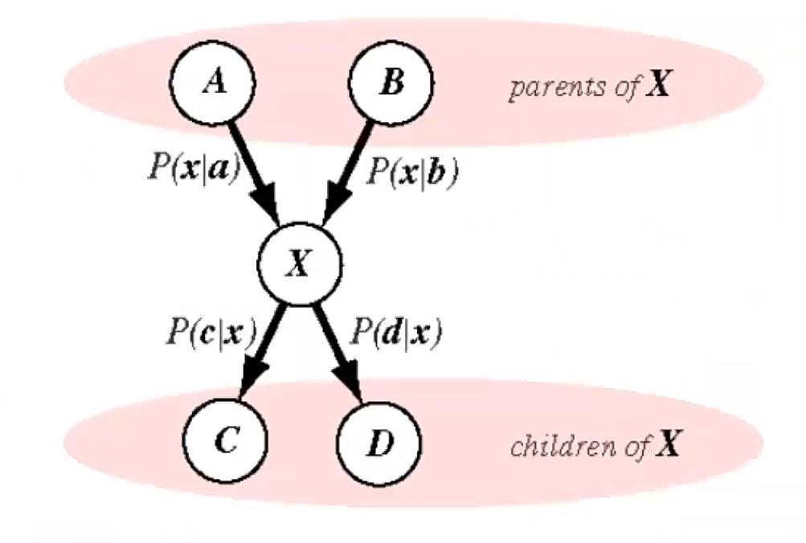

---

## Chapter 7 : Non‑parametric Methods (Parzen Windows)

**Overview:**  
Parzen window density estimation for a bivariate Gaussian with kernel \( \varphi(\mathbf{u}) = N(0,I) \).  
Window width \( h_n = h_1 / \sqrt{n} \) with \( h_1 = 2, 1, 0.5 \) and sample sizes \( n = 10, 100, 1000 \).

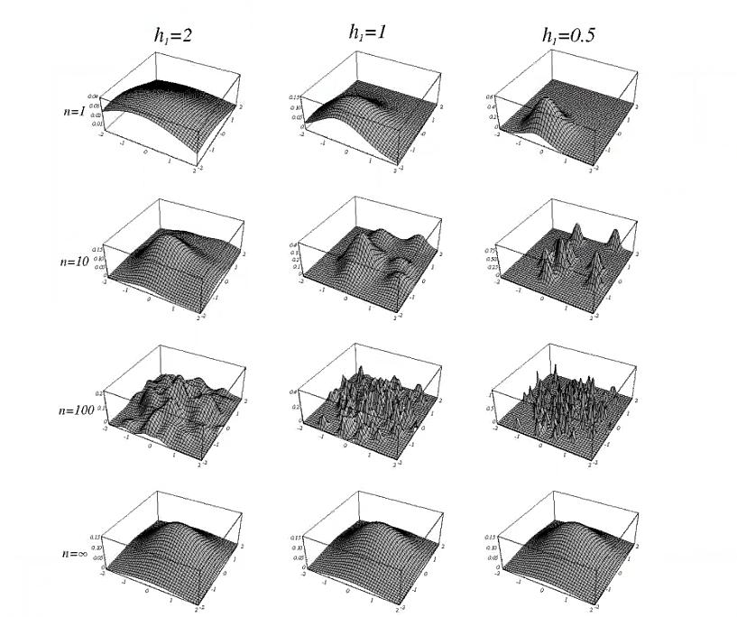

---

## Chapter 8 : Feature Reduction & Selection

**Overview:**  
Techniques to reduce dimensionality and select informative features.  
(No figure was present in the original slides.)

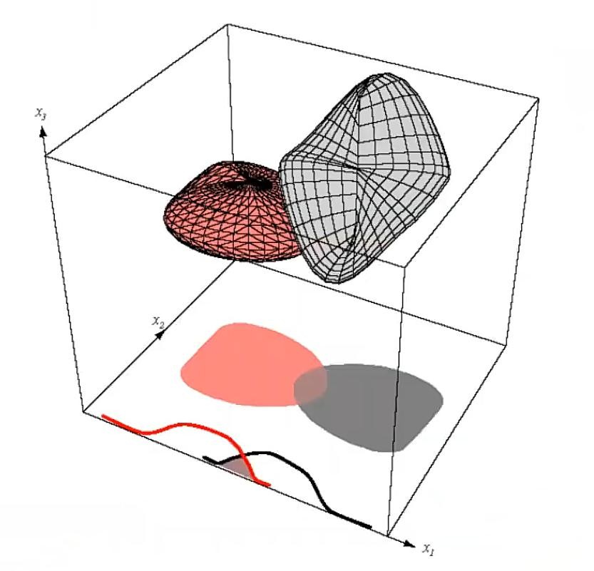

---

## Chapter 9 : k‑Nearest Neighbor Classifier

**Overview:**  
Non‑parametric classification based on majority vote of the k closest training points.  
Diagram shows points \( x_1, x_2, x_3 \) in feature space.

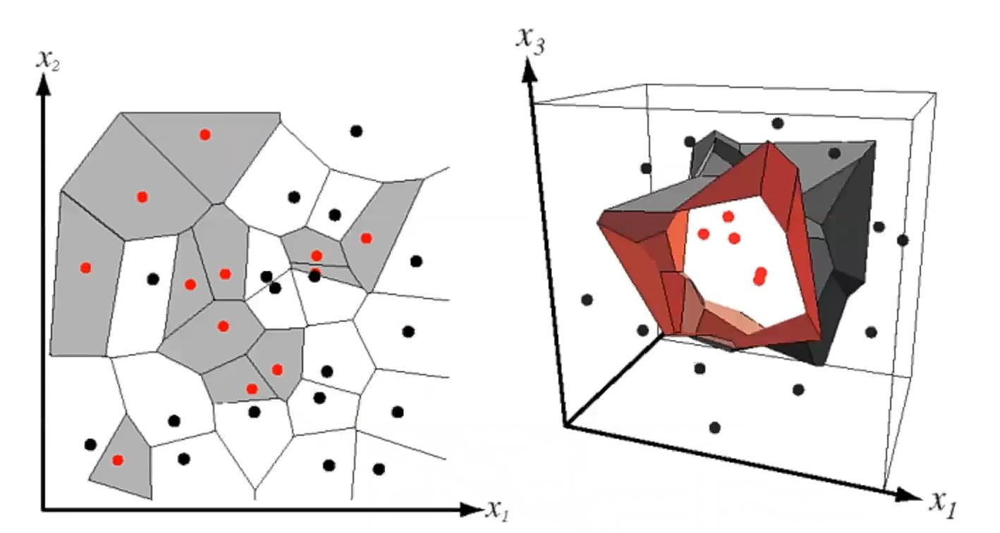

---

## Chapter 10 : Linear Discriminants & Support Vector Machines (SVM)

**Overview:**  
Mapping from \( \mathbb{R}^2 \) to \( \mathbb{R}^3 \) using  
\( (y_1, y_2, y_3) = (x_1^2, \sqrt{2}x_1x_2, x_2^2) \).  
This allows a linear decision boundary in the transformed space, which corresponds to a non‑linear boundary in the original space.

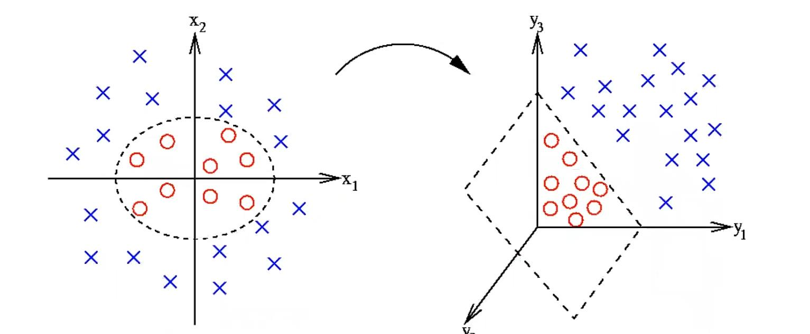

---

## Chapter 11 : Neural Networks & Decision Trees

**Overview:**  
- A fully connected three‑layer network: \( d \) inputs, \( n_H \) hidden units, output \( z \) compared to target \( t \).  
- A decision tree for fruit classification: root (color) → size → shape → fruit type (apple, banana, grapefruit, lemon, cherry, etc.).

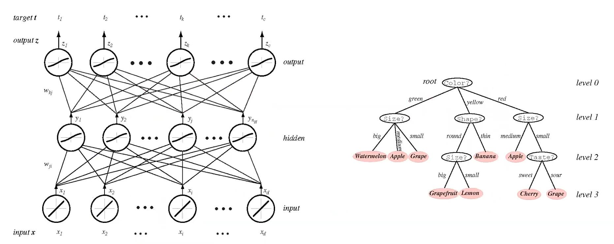

---

## Chapter 12 : Unsupervised Learning & Clustering

**Overview:**  
Clustering is difficult because data can form clusters of different shapes and sizes.  
The number of clusters depends on resolution (fine vs. coarse).  
Question: *How many clusters do you see? 5, 8, 10, or more?*

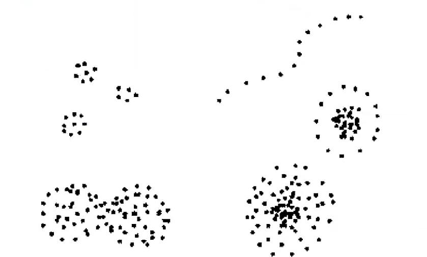

---

## Chapter 13 : Algorithm‑Independent Learning Issues

**Overview:**  
Plot of **validation error** vs. **training error** as training progresses.  
Optimal stopping point is where validation error starts increasing (avoid overfitting).

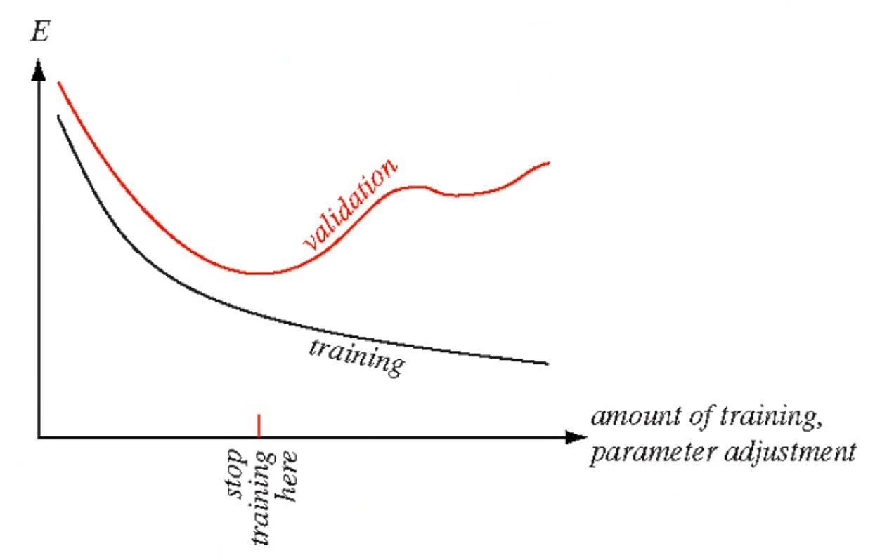

---

## Chapter 14 : Structural & Syntactic Pattern Recognition

**Overview:**  
Scene matching using attributed graphs:  
(a) Query scene (red rectangle),  
(b) Query graph – red=city, green=park, blue=water,  
(c) Nodes with similar labels,  
(d) Subgraphs matching the query.

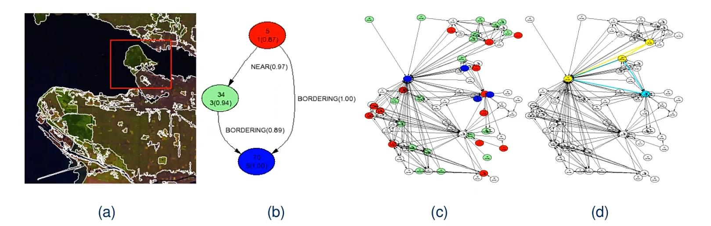

---

---

## Chapter 4: Expectation-Maximization & Mixture Density

*Illustration of EM iterations for a mixture of two Gaussians (L = 2,5,20).*

> ❌ **Image not yet available** in the uploaded set. Please add the slide showing `L=2, L=5, L=20`.

---

## Chapter 5: Hidden Markov Models (HMM)

*State transition matrix for weather example (rain/snow, cloudy, sunny).*

> ❌ **Image not yet available**. Expected matrix:  
> `[[0.4,0.3,0.3],[0.2,0.6,0.2],[0.1,0.1,0.8]]`

---

## Chapter 6: Bayesian Belief Networks

*Graph with nodes A, B, X, C, D and conditional probabilities.*

---

## Chapter 7: Non‑parametric Methods (Parzen Windows)

*Parzen window estimates for a bivariate Gaussian with different window widths `h` and sample sizes `n`.*

> The original figure also contains multiple density plots – this table shows numerical values for `h₁ = 2, 1, 0.5` and `n = 10, 100, 1000`.

---

## Chapter 8: Feature Reduction & Selection

*No figure was present in the original slides.*

---

## Chapter 9: k‑Nearest Neighbor Classifier

*Diagram with points `x₁, x₂, x₃`.*

> If this image is incorrect (shows red/blue/green points), it may belong to SVM. Please verify.

---

## Chapter 10: Linear Discriminants & SVM

*Mapping from ℝ² to ℝ³ using `(x₁², √2 x₁x₂, x₂²)` to obtain a non‑linear decision boundary.*

---

## Chapter 11: Neural Networks & Decision Trees

*Fully connected 3‑layer network and a fruit classification tree.*

> The uploaded image shows repeated numeric entries – likely a placeholder. The original slide contains a clear network diagram and a tree (root: green/yellow/red, then size, shape).

---

## Chapter 12: Unsupervised Learning & Clustering

*How many clusters do you see? (resolution‑dependent).*

> ❌ **Image missing**. Original figure shows a 2D scatter plot with varying number of clusters.

---

## Chapter 13: Algorithm‑Independent Learning Issues

*Validation vs. training error – where to stop training.*

---

## Chapter 14: Structural & Syntactic Pattern Recognition

*Scene matching using attributed graphs (query, query graph, node labels, subgraph match).*

---

## Additional Figures (uncertain mapping)

These images were uploaded but could not be confidently assigned to a specific chapter. They may be duplicates or parts of exercises.

---

## 📝 How to use this README

- Make sure all image files are in the `./Pic/` folder **exactly** as named above.
- Adjust the `width` attribute inside `` if you want larger/smaller images.
- For missing chapters (4,5,12), replace the `❌` placeholder with your actual images later.

---

**Happy studying!** 🎓  
*Last updated: May 2026*
